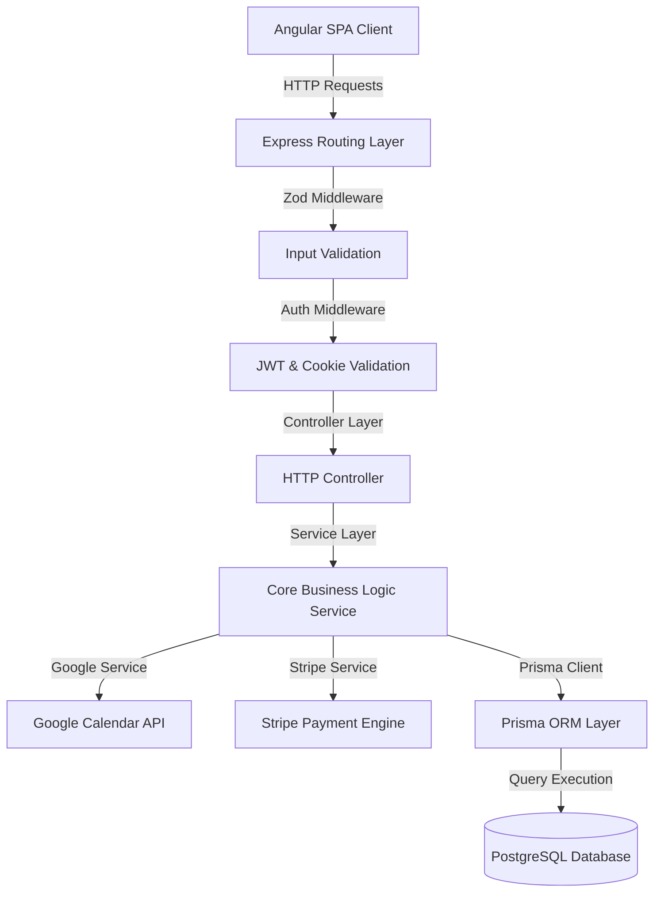

# Bookly — Enterprise Appointment Booking SaaS (Academic Thesis Reference)

Bookly is a production-ready, highly secure, containerized **Calendly-style** multi-tenant appointment scheduling platform. It is built as an optimized monorepo splitting an **Angular 21 (Signals-driven SPA) Frontend** from a **Node.js 24 / Express 5 REST API** backed by a **PostgreSQL database** via **Prisma ORM**.

This document serves as the absolute technical source of truth for the codebase, containing the deep architectural specifications, data models, integration flows, and security measures required to compile a comprehensive academic/dissertation thesis.

---

## 📁 System Architecture & Directory Topology

The project follows a decoupled Monorepo topology designed for high-availability cloud deployments (GCP/GKE) and localized containerized development.

```
Bookly/
├── .github/
│   └── workflows/
│       └── ci.yml               # Parallelized GitHub Actions CI workflow (linting, testing, type-checking)
├── k8s/                         # GKE Production Orchestration Manifests
│   ├── backend-secret-template.yaml # Secrets mapping (Postgres connection, OAuth, Stripe keys)
│   ├── db-migration-job.yaml    # Kubernetes pre-deployment db migration job
│   ├── backend-deployment.yaml   # Multi-replica API pod deployment configurations
│   └── backend-service.yaml      # ClusterIP Service configuration
├── gcp-deploy-backend.sh        # Automated GAR/GKE cloud deployment script
├── api/                         # Backend API Service (Express + Prisma)
│   ├── src/
│   │   ├── config/              # Centralized environment configs (index.js), Logger (logger.js), and OAuth (passport.js)
│   │   ├── controllers/         # HTTP Controller layer (extracts request data, maps parameters, returns API responses)
│   │   ├── middleware/          # Security middlewares (auth, validation, global error handler, rate limiters)
│   │   ├── prisma/              # Schema configurations (schema.prisma) and Database Seeding (seed.js)
│   │   ├── routes/              # Express API router mappings (auth, users, bookings, billing, integrations)
│   │   ├── services/            # Main Business Logic (Availability calculations, Google API integrations, Stripe workflows)
│   │   ├── utils/               # Common helper classes (Prisma singleton, Custom ApiError, standardize response formatters)
│   │   └── validators/          # Strong type runtime checks using Zod schemas
│   ├── Dockerfile               # Multi-stage production container build (deps -> build -> runtime)
│   ├── docker-compose.yml       # Local developer orchestration (Node.js API container + PostgreSQL service)
│   └── package.json
└── frontend/                    # Standalone Angular 21 Single Page Application
    ├── src/
    │   ├── app/
    │   │   ├── core/            # Global application singletons (guards, interceptors, HTTP communication services)
    │   │   ├── features/        # Feature modules (auth pages, private owner dashboard, public-facing booking flow)
    │   │   ├── app.config.ts    # Centralized providers configuration (Router, HttpClient, Zone-less hydration)
    │   │   └── app.routes.ts    # Application routing definitions & route guards mapping
    │   ├── index.html
    │   ├── main.ts              # Angular bootstrap entrypoint
    │   ├── index.css            # Global visual design system & styling rules
    │   └── styles.scss          # Core SCSS rules
    ├── tailwind.config.js       # Custom design system configurations (colors, typography, grid layouts)
    └── package.json
```

---

## 🏗️ Comprehensive Architecture & Flow Design



### 1. The Request-Response Lifecycle
1. **Network Entrypoint:** A client request strikes the API. Express forwards the path to the corresponding router (`api/src/routes`).
2. **Validator Stage:** The `validate.middleware.js` dynamically checks query parameters, route parameters, and payload bodies against Zod schemas. If invalid, the request is terminated with a `400 Bad Request` API response.
3. **Session Verification (Authentication):** The `auth.middleware.js` extracts the encrypted JWT token from incoming HttpOnly cookies. It parses the signature, checks token lifespan, fetches the database user record, and populates `req.user`.
4. **Controller Action:** The Controller handler extracts path values, passes arguments to target service methods, and wraps outputs inside consistent response utilities (`src/utils/apiResponse.js`).
5. **Business Logic Layer:** The Service file handles logical decisions, makes calls to external APIs (Google Calendar, Stripe), interacts with database transaction blocks, and logs events.
6. **Data Storage Sync:** Prisma ORM performs type-safe SQL query executions.
7. **Global Exception Boundary:** Any thrown errors are caught by `catchAsync` wrappers and passed to `errorHandler.middleware.js` to return formatted JSON responses.

---

## 💾 Database Schema & Data Integrity Design

The database schema is defined inside `schema.prisma` and maps directly to a relational PostgreSQL database.

```mermaid
erDiagram
    USER ||--o{ AVAILABILITY_BLOCK : "has availability blocks"
    USER ||--o{ BOOKING : "hosts bookings"
    USER ||--o{ REFRESH_TOKEN : "owns refresh tokens"
    
    USER {
        string id PK
        string username UNIQUE
        string email UNIQUE
        string password
        string firstName
        string lastName
        string phone
        string avatar
        boolean isActive
        boolean emailVerified
        string googleId UNIQUE
        string googleAccessToken
        string googleRefreshToken
        datetime googleTokenExpiry
        SubscriptionPlan plan
        datetime createdAt
        datetime updatedAt
    }

    AVAILABILITY_BLOCK {
        string id PK
        string userId FK
        date date
        string startTime
        string endTime
        datetime createdAt
    }

    BOOKING {
        string id PK
        string hostId FK
        string guestName
        string guestEmail
        string meetingName
        integer duration
        date date
        string startTime
        string endTime
        BookingStatus status
        string meetLink
        string googleEventId
        string notes
        string cancelReason
        datetime cancelledAt
        datetime completedAt
        datetime createdAt
        datetime updatedAt
    }

    REFRESH_TOKEN {
        string id PK
        string userId FK
        string tokenHash UNIQUE
        datetime expiresAt
        boolean isRevoked
        datetime createdAt
        datetime revokedAt
    }
```

### Table & Column Details

#### `users` Table
Stores the user profile data, Google OAuth syncing access details, and billing levels.
* `id` (`String`): Primary Key (utilizing CUID identifiers).
* `username` (`String`): Unique string used in public booking paths (`/booking/:username`).
* `email` (`String`): Unique user contact address.
* `password` (`String`, nullable): BCrypt-hashed password. Nullable to support pure Google Sign-in accounts.
* `firstName` / `lastName` (`String`): Primary user names.
* `isActive` (`Boolean`): Flag allowing quick administrative locks or profile deletions.
* `plan` (`SubscriptionPlan`): Subscription tier (`FREE`, `PREMIUM`, `ULTIMATE`). Determines if scheduling links can be shared.
* **OAuth Sync Attributes:** `googleId` (unique mapping), `googleAccessToken`, `googleRefreshToken`, and `googleTokenExpiry`.

#### `availability_blocks` Table
Defines blocks of available working slots set by a host user.
* `userId` (`String`): Foreign Key pointing to `User.id`.
* `date` (`DateTime` / `@db.Date`): The target date.
* `startTime` / `endTime` (`String`): `HH:mm` format strings defining the available segment bounds (e.g. `09:00` to `17:00`).
* **Indexes:** Multi-column index on `[userId, date]` for rapid time-slot lookup queries.

#### `bookings` Table
Tracks reservations booked by guest users with hosts.
* `hostId` (`String`): Foreign Key pointing to `User.id`.
* `guestName` (`String`): Max length 50. Name of the booking guest.
* `guestEmail` (`String`): Max length 100. Contact email of the guest.
* `meetingName` (`String`): Max length 50. Custom name of the event.
* `duration` (`Int`): Duration in minutes.
* `date` (`DateTime` / `@db.Date`): Reservation date.
* `startTime` / `endTime` (`String`): `HH:mm` format strings defining start and end boundaries.
* `status` (`BookingStatus`): Enum (`PENDING`, `CONFIRMED`, `CANCELLED`, `COMPLETED`, `NO_SHOW`).
* `notes` (`String`, nullable): Max length 500. Guest comments.
* `meetLink` (`String`, nullable): Dynamically injected Google Meet link generated by Google Calendar integrations.

#### `refresh_tokens` Table
Supports secure dual-token JWT rotation.
* `tokenHash` (`String`, unique): Cryptographic SHA-256 hash of the issued refresh token.
* `expiresAt` (`DateTime`): Expiry timestamp matching JWT signatures.
* `isRevoked` (`Boolean`): Flag indicating if the refresh token has been invalidated.

---

## 🔒 Security Infrastructure & Token Rotation Lifecycle

### 1. Dual-Token JWT Auth Pattern
Authentication is managed via two secure tokens set in cookies:
1. **Access Token (`accessToken`):**
   * Lifespan: `15 minutes`.
   * Signed payload contains `id`, `email`, and `username`.
   * Scoped via `HttpOnly`, `Secure` (production), and `SameSite=Lax` browser cookies.
2. **Refresh Token (`refreshToken`):**
   * Lifespan: `7 days`.
   * Stored in the database as a SHA-256 hash.
   * Scoped via `HttpOnly`, `Secure` (production), and `SameSite=Lax` browser cookies at root path `/`.

```
[Client App]                              [API Authorization Server]
    |                                                 |
    |---- 1. API Call (expired accessToken cookie) -->| (Blocks request with 401)
    |<--- 2. Returns 401 Access Token Expired --------|
    |                                                 |
    |---- 3. POST /refresh-token (with cookies) ----->|
    |                                                 | (Checks refreshToken validity)
    |                                                 | (Verifies hash match in DB)
    |                                                 | (Revokes old refresh token)
    |                                                 | (Issues new accessToken & refreshToken pair)
    |<--- 4. Sets new cookies + Returns Success -------|
```

### 2. Google OAuth Integration Flow
OAuth 2.0 integration handles both user signup/signin and Calendar permissions:
1. When a user requests login or links their calendar, they are redirected to `/api/v1/auth/google`.
2. The endpoint attaches a secure cryptographic `state` token (valid for 10 minutes) to prevent Cross-Site Request Forgery (CSRF).
3. The callback redirect `/api/v1/auth/google/callback` decodes the state to verify the requesting session.
4. It completes the oauth handshake, receives `accessToken` and `refreshToken` variables, and stores them in the database to enable background Google Calendar syncing.

### 3. Attack Prevention Middlewares
* **Auth Rate Limiter:** Applied on auth routes (`login`, `register`, `forgot-password`). Restricts requests to `10 per 15 minutes` to mitigate brute-force attacks.
* **Helmet Security Middleware:** Restricts cross-domain scripts, frames, and resource sniffing.
* **CORS Policy:** Strict domain restrictions locked down to the frontend host.
* **SQL Injection & XSS Shield:** Sanitized data validation utilizing Zod schemas before parameters reach Prisma query compilers.

---

## 🔌 API Route Specifications

All endpoints are prefix-mounted at `/api/v1`.

### 🔐 Authentication Routes (`/auth`)

| Endpoint | Method | Access | Description | Payload Schema | Response |
|----------|--------|--------|-------------|----------------|----------|
| `/register` | `POST` | Public | Register a new User | `{ username, email, password, firstName, lastName }` | `{ success: true, data: { user } }` |
| `/login` | `POST` | Public | Login authenticating credentials | `{ email, password }` | Sets `accessToken`/`refreshToken` cookies, returns user data |
| `/refresh-token` | `POST` | Public | Rotates expired access tokens | *Requires cookie state* | Rotates cookies, returns success |
| `/logout` | `POST` | Private | Revokes tokens and clears session | *Requires session* | Clears browser cookies |
| `/me` | `GET` | Private | Fetch authenticated user data | *Requires session* | `{ success: true, data: { user } }` |
| `/google` | `GET` | Public | Initiate Google OAuth flow | Optional: `?action=link` | Redirects to Google Consent Screen |
| `/google` | `DELETE` | Private | Disconnect Google Calendar sync | *Requires session* | `{ success: true, message: "Disconnected" }` |

### 📅 Availability Routes (`/availability`)

| Endpoint | Method | Access | Description | Payload Schema | Response |
|----------|--------|--------|-------------|----------------|----------|
| `/blocks` | `GET` | Private | Fetch available date blocks | None | `{ success: true, data: [ blocks ] }` |
| `/blocks` | `POST` | Private | Set a new available time block | `{ date (YYYY-MM-DD), startTime (HH:mm), endTime (HH:mm) }` | `{ success: true, data: { block } }` |
| `/blocks/:id` | `PUT` | Private | Update an available time block | `{ date (YYYY-MM-DD), startTime (HH:mm), endTime (HH:mm) }` | `{ success: true, data: { block } }` |
| `/blocks/:id` | `DELETE` | Private | Delete an available time block | None | `{ success: true, message: "Deleted" }` |
| `/blocks/clear` | `DELETE` | Private | Clear all availability blocks | None | `{ success: true, message: "Cleared" }` |

### 📝 Bookings Routes (`/bookings`)

| Endpoint | Method | Access | Description | Payload Schema | Response |
|----------|--------|--------|-------------|----------------|----------|
| `/public` | `POST` | Public | Create booking as a guest | `{ hostUsername, guestName, guestEmail, meetingName, duration, date, startTime, notes }` | `{ success: true, data: { booking } }` |
| `/public/:id` | `GET` | Public | Fetch booking details | None | `{ success: true, data: { booking } }` |
| `/public/cancel/:id` | `POST` | Public | Cancel booking as guest | `{ cancelReason }` | `{ success: true, message: "Cancelled" }` |
| `/` | `GET` | Private | Fetch booking history for host | None | `{ success: true, data: [ bookings ] }` |
| `/:id/status` | `PATCH` | Private | Confirm, complete, or cancel booking | `{ status (Enum), cancelReason }` | `{ success: true, data: { booking } }` |

### 💳 Billing & Payment Routes (`/billing`)

| Endpoint | Method | Access | Description | Payload Schema | Response |
|----------|--------|--------|-------------|----------------|----------|
| `/checkout` | `POST` | Private | Create Stripe checkout session | `{ plan (Enum) }` | `{ success: true, data: { checkoutUrl } }` |
| `/confirm` | `POST` | Private | Confirm stripe success state | `{ sessionId }` | `{ success: true, data: { plan } }` |
| `/webhook` | `POST` | Webhook | Stripe transaction webhook | Raw payload signature | Direct response to Stripe engines |

---

## ⚡ Integration Details & Core Workflows

### 1. Availability Calculation Algorithm
The core service method `getAvailableSlots(username, date, duration)` calculates open slots dynamically:
1. Fetches the host user profile and retrieves all configured `AvailabilityBlock` records matching the target date.
2. If no available blocks are registered, it returns an empty array.
3. Splits availability blocks into sequential candidate slots based on the service's `duration`.
4. Queries the `Booking` database table to fetch all reservations (`status !== 'CANCELLED'`) for the host on that date.
5. If Google Calendar integrations are linked, it triggers the Google API client, pulls the host's primary calendar events, and maps busy blocks.
6. Filters out any candidate slots that overlap with local database bookings or synced Google Calendar events.
7. Filters out slots starting within `1 hour` of the query time (prevents last-minute bookings).
8. Returns the remaining available slots as `{ startTime, endTime }` arrays.

### 2. Stripe Checkout Integration
Tiers are integrated using Stripe Checkout:
* Users subscribe to plans (`PREMIUM` at $9/mo, `ULTIMATE` at $19/mo) via Stripe billing sessions.
* The API constructs the Stripe payload pointing to local callback redirection routes:
  * Cancel redirect: `http://localhost:4200/dashboard`
  * Success redirect: `http://localhost:4200/dashboard?session_id={CHECKOUT_SESSION_ID}`
* On checkout completion, the backend Stripe Webhook endpoint verifies signatures, extracts the metadata containing the user ID, and updates the database record state to the corresponding `SubscriptionPlan` tier.

---

## 🖥️ Angular Frontend Design Patterns

### 1. Zone-less Reactivity with Signals
The client uses Angular 21's native **Signals** to manage state reactively without zone-pollution:
```typescript
readonly currentUser = signal<User | null>(null);
readonly isAuthenticated = signal<boolean>(false);
```
Computing derived variables dynamically handles UI states:
```typescript
hostName = computed(() => {
  const h = this.host();
  return h ? `${h.firstName} ${h.lastName}` : 'Loading...';
});
```

### 2. Authentication Guards & Cookies Interceptor
* **Functional Auth Guards (`authGuard` & `noAuthGuard`):** Verify session states on transitions. If the user session is active, they are redirected from `/login` to `/dashboard`. If the token is invalid or missing, they are redirected back to `/login`.
* **Credential Sharing (`authInterceptor`):** Configures HTTP request clones to dynamically attach `{ withCredentials: true }` to every API request, allowing the browser to send HttpOnly session cookies automatically.

---

## 🚀 Running, Testing, & Deploying

Detailed steps for executing, verifying, and launching Bookly.

### 1. Local Environment Startup
Ensure Docker and Node.js are running on your system.

```bash
# Set up database and API server
cd api
cp .env.example .env
docker compose up -d --build

# Run database seeds to setup demo user accounts
npm run db:seed

# Launch the Angular client
cd ../frontend
npm install
npm start
```

### 2. Verification & Testing
```bash
# Execute backend vitest suite (244 unit tests covering services, routes, and middlewares)
cd api
npm test

# Verify frontend types and template compilation
cd ../frontend
npm run build
```

### 3. Production GKE/GAR Deployment Flow
We deploy the containerized API using a pre-deployment migration schema:
1. Compile the production multi-stage container target:
   `docker build -t gcr.io/your-project/bookly-api:latest -f api/Dockerfile api/`
2. Sync migrations before rollout using GKE Job manifests:
   `kubectl apply -f k8s/db-migration-job.yaml`
3. Execute the rolling update deployment:
   `kubectl apply -f k8s/backend-deployment.yaml`
4. Track the live rolling process:
   `kubectl rollout status deployment/backend-api`
5. Expose the API internally via the stable service layer:
   `kubectl apply -f k8s/backend-service.yaml`